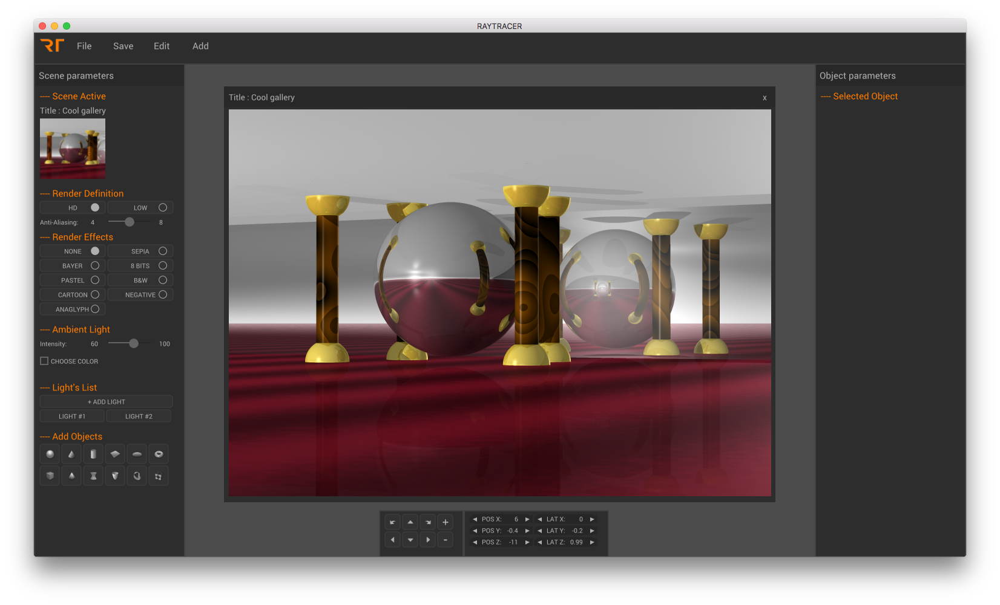
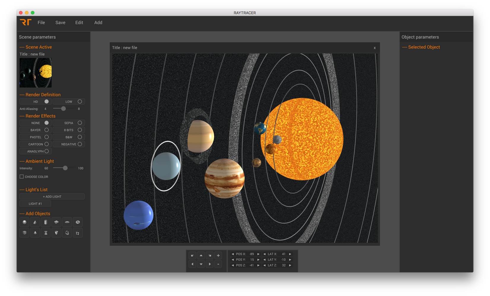
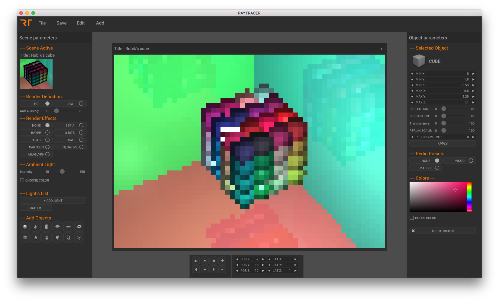
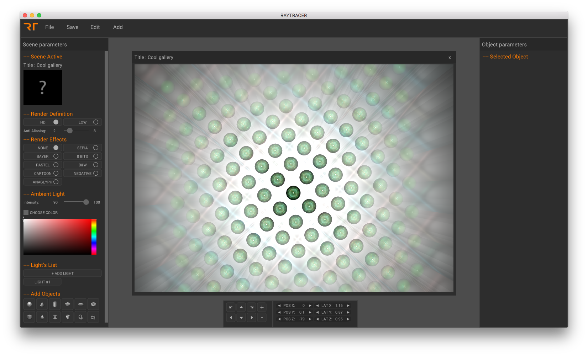
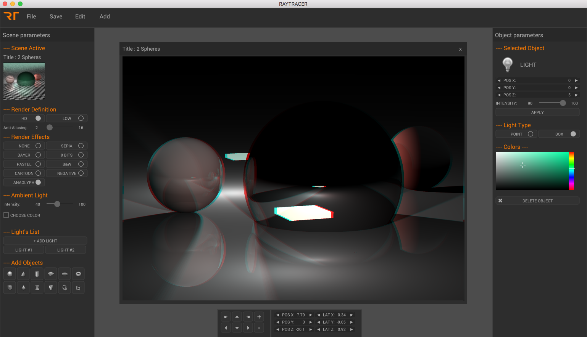

# RayTracer

## Description

This is an interfaced ray tracer engine on MAC OSX Platform (we may support linux platforms later);

### Features

- lights : ambient, point, parallel, light box;
- shadows;
- soft shadows with light box;
- reflexion;
- transparency;
- 12 shapes (sphere, plane, cone, cylinder, cube, triangle, disk, torus, mobius, hollow cube, hyperboloid, paraboloid);
- perlin noise;
- Anti-Aliasing;
- post-process effects (sepia, black & white, cartoon, pastel, etc);
- anaglyph 3D;
- Clustering;

## Dependencies

Latest CUDA Toolkit
SDL2
LibXML2

* You could simply use brew to install dependencies (except CUDA Toolkit) : brew install sdl2, brew install libxml2.
* a Nvidia graphic card is required.

## Installation

Clone the repository and run with:

``` bash
$> make -j
$> ./bin/RT
```
To run in clustering mode as a client:
``` bash
$> sh scripts/config_cluster.sh [master IP]
```
## Media

https://youtu.be/ylTecs2UYDA
https://youtu.be/TRUApBIVk-I








## Authors

Antoine Anzieu
aanzieu@student.42.fr

Stefan VILAU
svilau@student.42.fr

Xavier Pouzenc
xpouzenc@student.42.fr

Hugo Weber
huweber@student.42.fr
